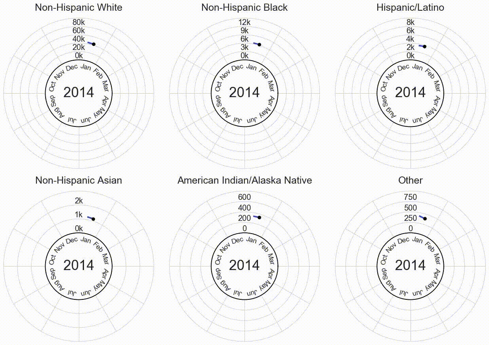
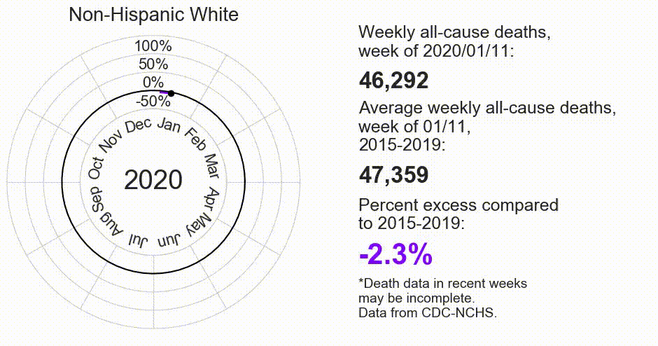
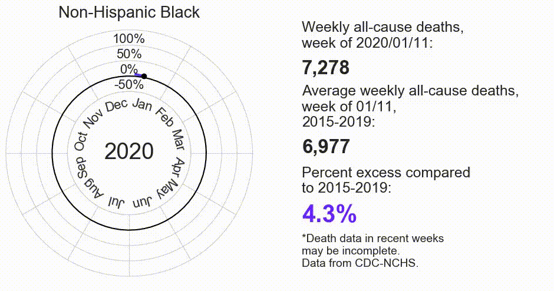
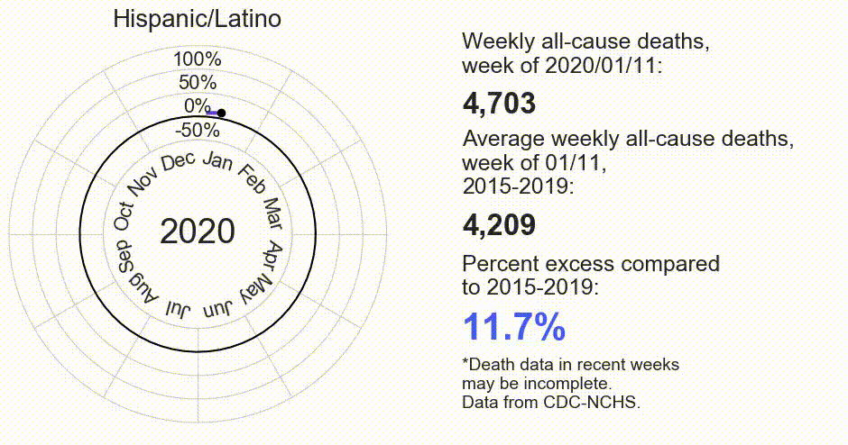
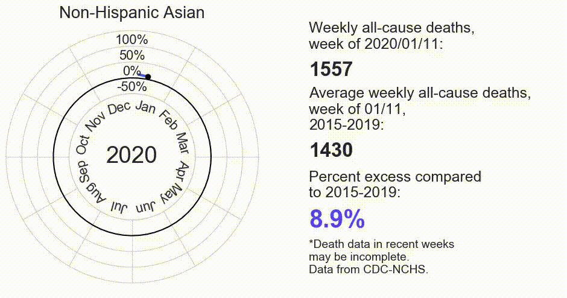
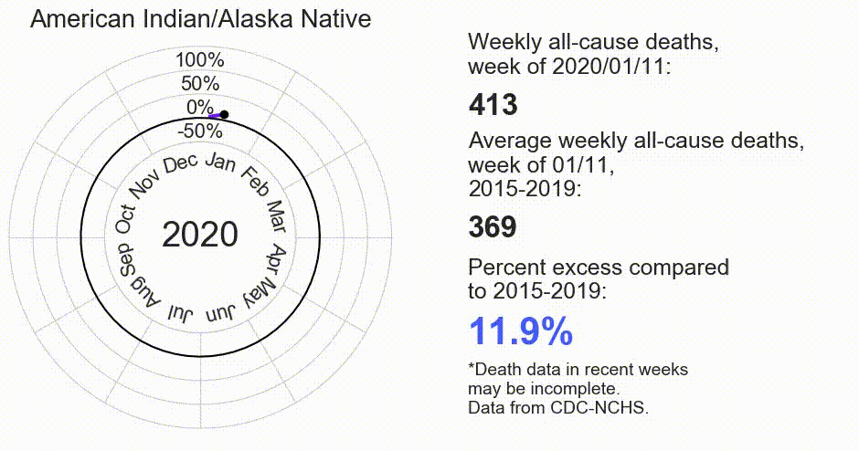
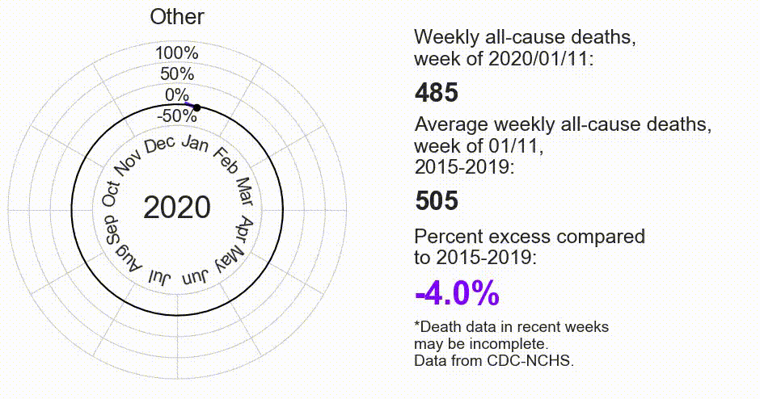

# Visualizing American excess deaths during the COVID-19 pandemic by race and ethnicity
The following plots show weekly all-cause deaths by race and ethnicity over time.
[Watch on YouTube.](https://youtu.be/xJOJGUFKKkc)
#### (More complete description/abstract to come.)

## Weekly all-cause deaths over time by race/ethnicity.

## Relative change (percent excess) in weekly deaths by race/ethnicity, 2020-2021.

