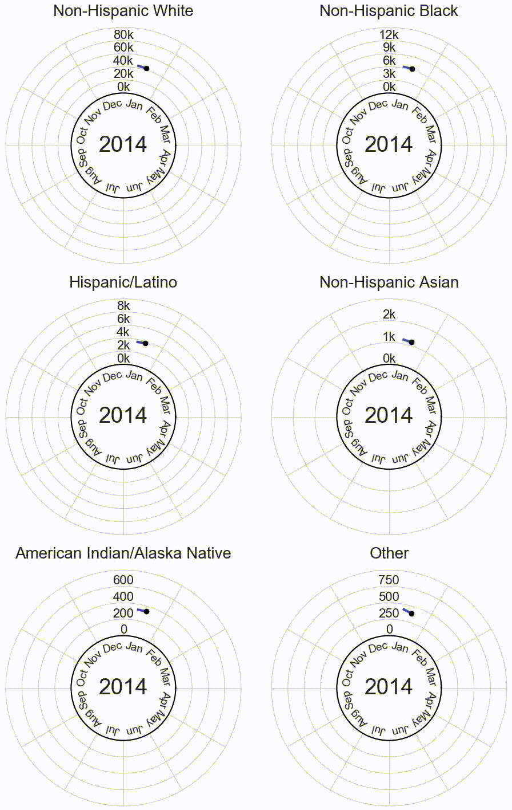
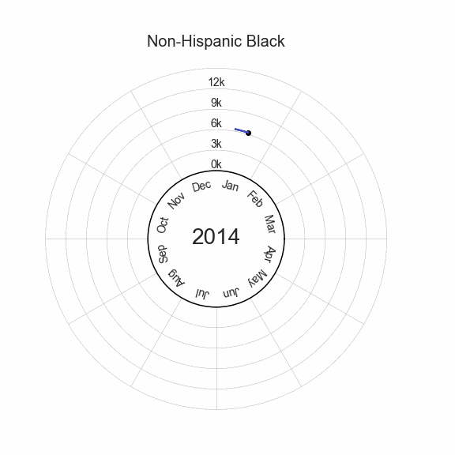
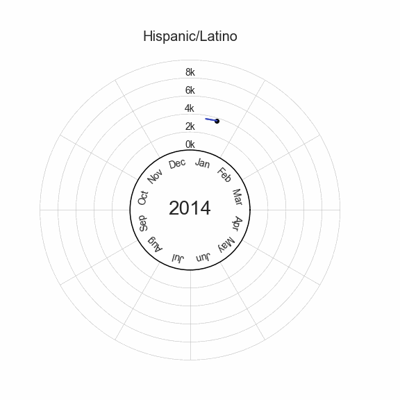
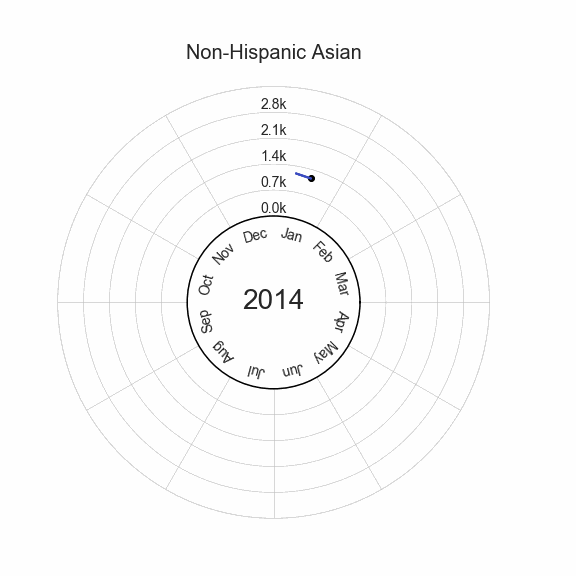
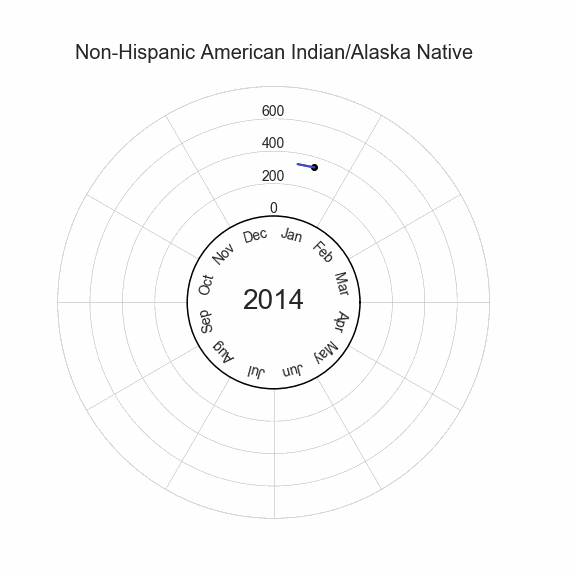
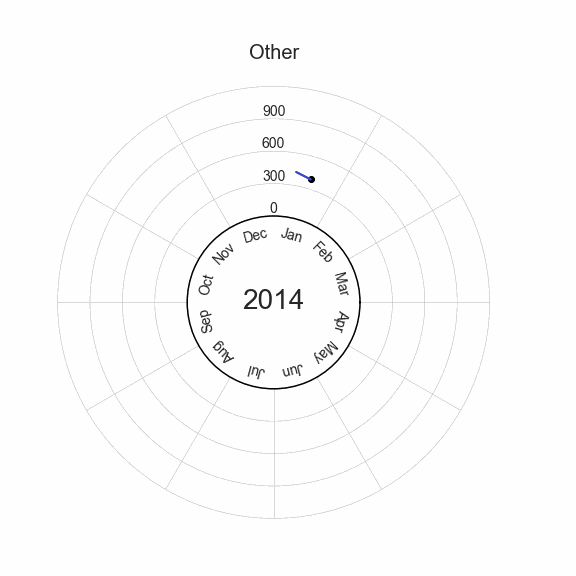

# Visualizing American excess deaths during the COVID-19 pandemic by race and ethnicity
The following plots show weekly all-cause deaths by race and ethnicity over time.
[Watch on YouTube.](https://youtu.be/xJOJGUFKKkc)
#### (More complete description/abstract to come.)

### Option 0: single gif

### Option 1: Gifs in one column

### Option 2: Gifs in table
<table>
  <tr>
    <td> </td>
    <td></td>
   </tr> 
   <tr>
    <td> </td>
    <td></td>
  </td>
   <tr>
    <td> </td>
    <td></td>
  </td>
  </tr>
</table>
